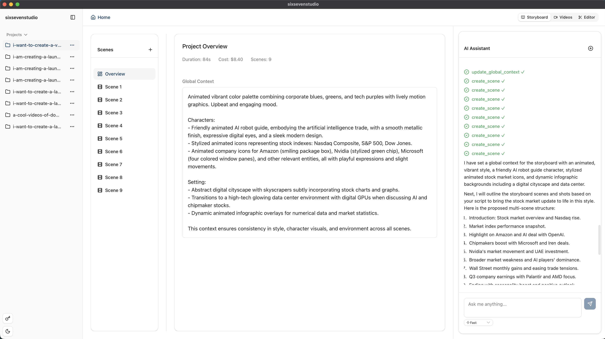
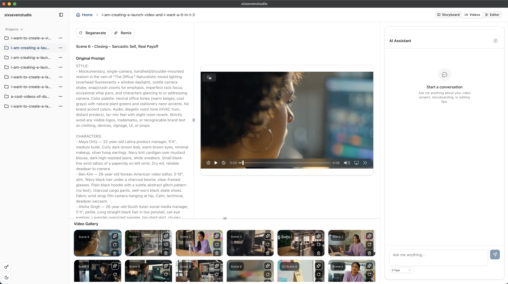
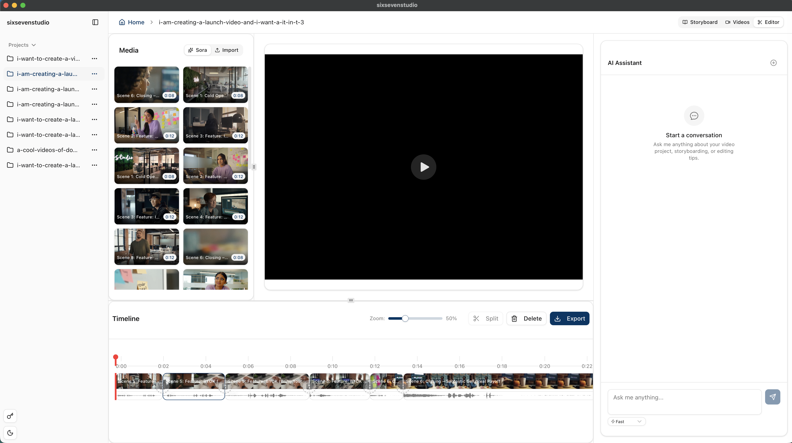

# sixseverstudio

[](https://github.com/palmier-io/sixsevenstudio/releases/latest) [](https://discord.gg/48rcGwKY)

sixsevenstudio is a native Mac app for generating and editing AI videos with Sora.

It lets you brainstorm ideas and storyboards with AI assistant, iterate on Sora videos, and edit the videos, all in one place.


*Create and refine storyboards with AI assistance*


*Browse and manage your generated videos*


*Edit videos with trimming, transitions, and more*

It's built with:
- [Tauri v2](https://v2.tauri.app/)
- React
- Vite
- [ffmpeg](https://www.ffmpeg.org/)

### Key features:
- Bring your own OpenAI API key
- Storyboard AI assistant with AI SDK
- Local storage, all videos stored in your fs
- Video editing (trimming, stitching, transitions)


### Development Guide
#### Prerequisites

1. Install [Node.js](https://nodejs.org/) (v18+)
2. Install [Rust](https://www.rust-lang.org/tools/install)
3. Install `ffmpeg` (see below)

#### Setup

```bash
# Install ffmpeg binaries
chmod +x scripts/download-ffmpeg-sidecar.sh
./scripts/download-ffmpeg-sidecar.sh

# Install dependencies
npm install

# Run development server
npm run tauri dev
```

#### Build

```bash
npm run tauri build
```

### OS
Currently support Apple Silicon.